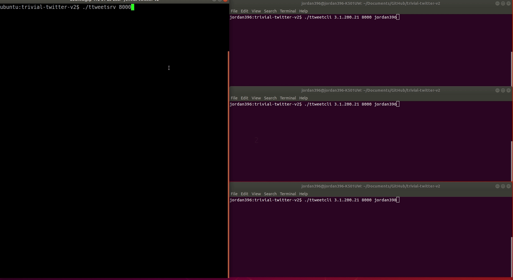

# trivial-twitter-v2

[](https://img.shields.io/github/license/jordan396/trivial-twitter-v2.svg)
[](https://img.shields.io/github/last-commit/jordan396/trivial-twitter-v2/master.svg)
[](https://img.shields.io/github/repo-size/jordan396/trivial-twitter-v2.svg)
[](https://img.shields.io/github/followers/jordan396.svg?label=Follow)

Simplistic simulation of *twitter* with support for multiple concurrent and persistent connections.



## Getting Started

These instructions will get you a copy of the project up and running on your local machine for development and testing purposes. Assume installation on *Ubuntu 18.04*.

### Prerequisites

You will need an updated version of *gcc* and *make* to compile program.
```
sudo apt-get install build-essential
```

### Installation
1. Clone this repository on both client and server machines.
   ```
   git clone https://github.com/Jordan396/trivial-twitter-v2.git
   ```
2. Navigate to directory and compile program.
   ```
   cd trivial-twitter-v2/
   make
   ```
3. On client machine, run:
   ```
   ./ttweetcli <ServerIP> <ServerPort> <Username>
   ```
4. On server machine, run:
   ```
   ./ttweetsrv <Port>
   ```

### Usage
Once a connection has been established, the client supports the following commands:
1. `tweet​ "<150 char max tweet>" <Hashtag>`
2. `subscribe​ <Hashtag>`
3. `unsubscribe​ <Hashtag>`
4. `timeline`
5. `exit`

### Notable Features
- Client usernames must be unique. The same username may be used after the previous client with that username exits.
- Hashtag `#ALL` is special; clients subscribed to it receive all tweets regardless of associated hashtag.
- Server *forks* a new process for each client connection request.
- Client and server follow the same format for transmitted data. This is necessary for both ends to know when transmission completes. The format is as follows:
  - First RCV_BUF_SIZE bytes are to indicate how much data the sender intends to send.
  - Remaining bytes are for the actual payload sent.

---

## License
This project is licensed under the MIT License - see the [LICENSE](LICENSE) file for details