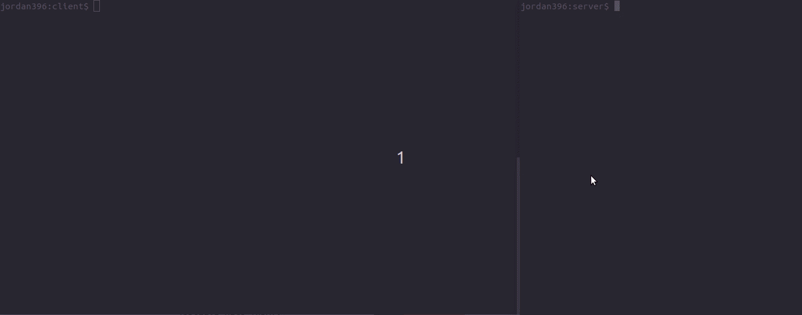

# trivial-twitter-v1

Simple socket application in C, with the following features:
  - Clients can upload *tweets* to and download *tweets* from a server. 
  - Upload/Download requests are secured using passphrases to prevent unauthorized requests.
  - Server stores only the latest *tweet* uploaded. 
  - Note that *tweets* cannot exceed 150 characters.



## Folder Structure
```
.
├── client         
│   ├── ttweetcli       // Executable for the client side
│   ├── ttweetcli.c     // Implementation file for the client side
│   └── ttweetcli.h     // Header file used for ttweetcli.c
├── configuration.txt
├── README.md
└── server
    ├── ttweetser       // Executable for the client side
    ├── ttweetser.c     // Implementation file for the server side
    └── ttweetser.h     // Header file used for ttweetser.c
```
*Files are documented according to Doxygen*

## Installation
### Server
1. Clone this repository.

  `git clone https://github.com/Jordan396/trivial-twitter-v2.git`

2. Navigate to this directory. 

3. Execute executable on your preferred port.

  `server/ttweetser <ServerPort>`

### Client
1. Clone this repository.

  `git clone https://github.com/Jordan396/trivial-twitter-v2.git`

2. Navigate to this directory. 

3. To upload a tweet:

  `client/ttweetcli -u <ServerIP> <ServerPort> "message"`

4. To download a tweet:

  `client/ttweetcli -d <ServerIP> <ServerPort>`
